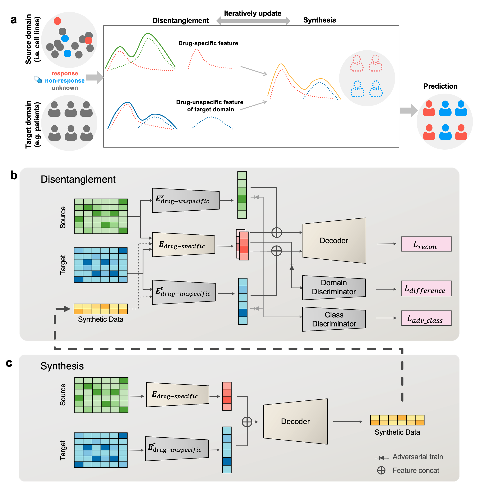

# DiSyn

This is a python implementation of Disentangled Synthesis Transfer Network (DiSyn) which enhances generalizability of drug response prediction by extracting features related and unrelated to drug responses to synthesize new training samples and improve prediction accuracy of label-scarce target domains.



## 1. Quick Start

### 1.1 Installation

**DiSyn** depends on PyTorch(1.13), Numpy, scikit-learn, pandas.

Use the provided configuration file `environment.yaml` in `/code` to create a conda required environment.
```commandline
$ cd /code
$ conda env create -f environment.yaml
```
Running the command above will create environment `disyn`. To activate the disyn environment, use:
```commandline
$ conda activate disyn
```
### 1.2 Re-evaluation and inferrence
For re-evaluation or inferrence with your own data, please refer to the `inference.py` in `code/` :
```commandline
$ cd /code
$ python inference.py --drug=$drug
# You might need to adjust the format of your data to align with the current schema.
```
We have provided the model parameters with the highest AUROC trained on GDSC and TCGA datasets.

| Drug           | SHA256                                                                                                                                                                                 |
|----------------|----------------------------------------------------------------------------------------------------------------------------------------------------------------------------------------|
| 5-Fluorouracil | [23f73c2b9e15af1fdc03ee081084b47b928433df40ed8dc86ff1b231b684f13d](https://github.com/LiHongCSBLab/DiSyn/blob/8453b3dbd27ffb84e3e4aacd4261f13b3436e621/best_models/5-Fluorouracil.pt)  |
| Bicalutamide   | [534968be4b0fa70dedb82ea78cfd50272b83aecf2f8fc7c480a34fcd17d2bc4c](https://github.com/LiHongCSBLab/DiSyn/blob/93771c61e08a5d85530e2c33d949449bc0899a9f/best_models/Bicalutamide.pt)    |
| Bleomycin      | [5948efc4c3508943847c11d75d17ea3e09230433d89445660fa745ba377e2deb](https://github.com/LiHongCSBLab/DiSyn/blob/56faa78a02ae3b4f272e40c39c72b36ec4f836ce/best_models/Bleomycin.pt)       |
| Cisplatin      | [02ad2b62dfd965fce5eaf80ed792ea1acebe61997cff17aa721d774f9d3dc2b8](https://github.com/LiHongCSBLab/DiSyn/blob/56faa78a02ae3b4f272e40c39c72b36ec4f836ce/best_models/Cisplatin.pt)       |
| Docetaxel      | [b4c815b847f70fd97364551c0380f007fe45cfcb8cb2e661121118148375207d](https://github.com/LiHongCSBLab/DiSyn/blob/56faa78a02ae3b4f272e40c39c72b36ec4f836ce/best_models/Docetaxel.pt)       |
| Doxorubicin    | [3b21e1a08f1fe3e61c83c0f1213e320a1d4d8e4f4b4bb8ada92f1634726a6888](https://github.com/LiHongCSBLab/DiSyn/blob/56faa78a02ae3b4f272e40c39c72b36ec4f836ce/best_models/Doxorubicin.pt)     |
| Etoposide      | [9114ee71b5ef014a18d6e9f8bbd7bddd3f5360bbff13afb221e76f739a95716f](https://github.com/LiHongCSBLab/DiSyn/blob/56faa78a02ae3b4f272e40c39c72b36ec4f836ce/best_models/Etoposide.pt)       |
| Gemcitabine    | [e6b658c88b0925ff27b236a5aaa4e028fa01a505a8d904979acbd74bb75584c1](https://github.com/LiHongCSBLab/DiSyn/blob/56faa78a02ae3b4f272e40c39c72b36ec4f836ce/best_models/Gemcitabine.pt)     |
| Methotrexate   | [d058ddfc92dfeaf62cefe799bead5b45dae87492dc4d97026af2fdbecfdc16f7](https://github.com/LiHongCSBLab/DiSyn/blob/56faa78a02ae3b4f272e40c39c72b36ec4f836ce/best_models/Methotrexate.pt)    |
| Paclitaxel     | [b0dabc57efc7fd349770e9eb627f16b7cb1079461093147870b18d1a3557e998](https://github.com/LiHongCSBLab/DiSyn/blob/56faa78a02ae3b4f272e40c39c72b36ec4f836ce/best_models/Paclitaxel.pt)      |
| Pemetrexed     | [2bd588f30c75d24e55afa300307443950ebea958efe62f00fc0511179baff549](https://github.com/LiHongCSBLab/DiSyn/blob/56faa78a02ae3b4f272e40c39c72b36ec4f836ce/best_models/Pemetrexed.pt)      |
| Sorafenib      | [b8d7dc953472538d87fb6ed8a3bd571fe49e148bb69e61157fca8ad000ec4651](https://github.com/LiHongCSBLab/DiSyn/blob/56faa78a02ae3b4f272e40c39c72b36ec4f836ce/best_models/Sorafenib.pt)       |
| Tamoxifen      | [ac65f639b980f3bfb363176bc50745be515a18828b3e0d25715077a97f716f4e](https://github.com/LiHongCSBLab/DiSyn/blob/56faa78a02ae3b4f272e40c39c72b36ec4f836ce/best_models/Tamoxifen.pt)       |
| Temozolomide   | [b65378082288d2ee9901a7aef54eff845e0b9be158ecc0cbce58deb132653480](https://github.com/LiHongCSBLab/DiSyn/blob/56faa78a02ae3b4f272e40c39c72b36ec4f836ce/best_models/Temozolomide.pt)    |
| Vinblastine    | [a6a1ed7f9b32da3424e4a354ef2036e1d4b4370f7a2258b06a88c683eba70f13](https://github.com/LiHongCSBLab/DiSyn/blob/56faa78a02ae3b4f272e40c39c72b36ec4f836ce/best_models/Vinblastine.pt)     |
| Vinorelbine    | [0f8dea963a249397d86d353025d58c63d1d3af19833c8648bbdea5e40c941750](https://github.com/LiHongCSBLab/DiSyn/blob/56faa78a02ae3b4f272e40c39c72b36ec4f836ce/best_models/Vinorelbine.pt)     |

## 2. Model Retraining
DiSyn adapted a composite architecture that includes an unsupervised pretraining process and iterates between disentanglement and a synthetic-data-invovled specific training stages. If you're looking to retrain the DiSyn models, please refer to the following instructions.

### 2.1 Data
The raw data we used for model training and figure reproducing is accessible at [Google Drive](https://drive.google.com/drive/folders/1TAX2J9lbhK3ffsvSrzvA-qCUvWIh7PiE?usp=sharing).
If you want to retrain the models, please download these files and extract them into `/data`.

### 2.2 Model Retraining
### initial steps
##### 2.2.1 Model Pre-train
```commandline
$ python main_pretrain.py --nums_recon=$nums_recon --nums_critic=$nums_critic --drop_out=$drop_out
```
For parameter ranges we used in the paper work, please refer to the supplementary materials.

##### 2.2.2 Task-specific train
```commandline
$ python main_task_specific_train.py --drug_name=$drug --nums_recon=$nums_recon --nums_critic=$nums_critic --drop_out=$drop_out
```
where `$nums_recon`, `$nums_critic`, `$drop_out` are the parameters employed in the pretraining process of the models.

### iterative steps
Depending on the number of iterations, it might be necessary to loop through the following two steps.

##### 2.2.3 Disentanglement
```commandline
$ python main_task_specific_train_step2_recon.py --drug_name=$drug --step=$step  --recon_epochs=$recon_epochs --clsadv_alpha=$clsadv_alpha --drop_out=$drop_out
```

##### 2.2.4 Task-specific train in iterration
```commandline
$ python main_task_specific_train_step2.py --drug_name=$drug --recon_epochs=$recon_epochs --clsadv_alpha=$clsadv_alpha --drop_out=$drop_out
```

## 3. Figures Reproducing

For figure reproducing, please refer to `/code/fig2_reproduce.py` and `/code/fig3_reproduce_AUROC.py`. <br/>
We have only listed the reproduction process of AUROC here for now.
```commandline
$ python /code/fig2_reproduce.py
$ python /code/fig3_reproduce_AUROC.py
```

## 4. Others

Parts of implementations of this project are coming from

```commandline
https://github.com/XieResearchGroup/CODE-AE
https://github.com/fungtion/DANN_py3
```

Respect to the contributors of the open source community.

<br/>